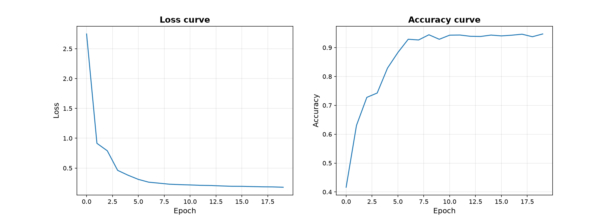
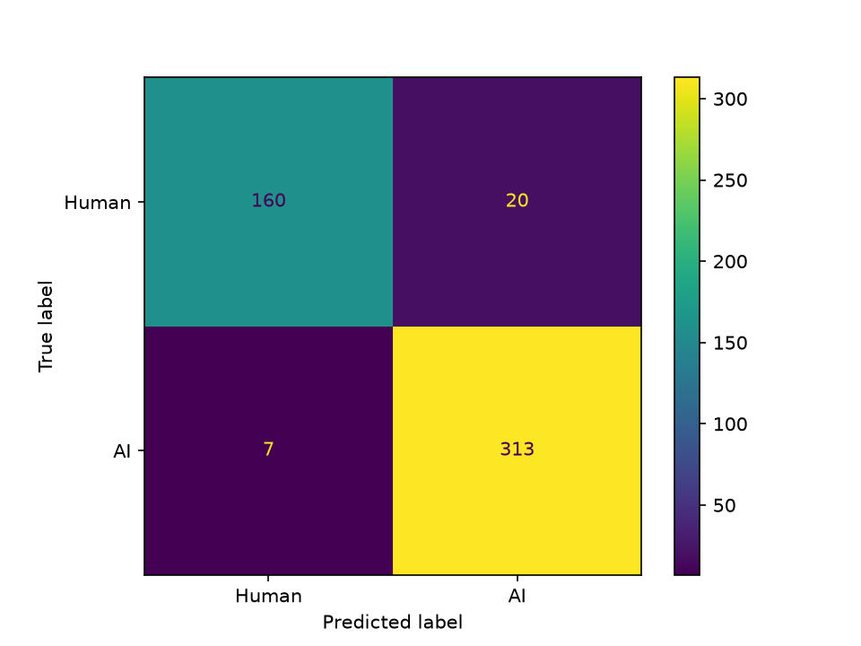
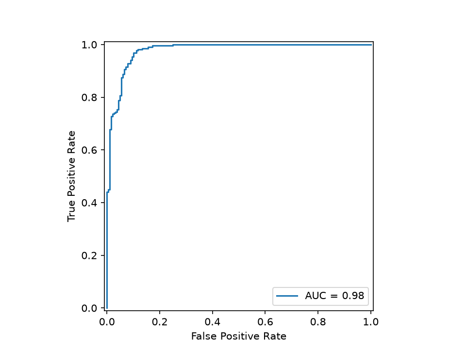
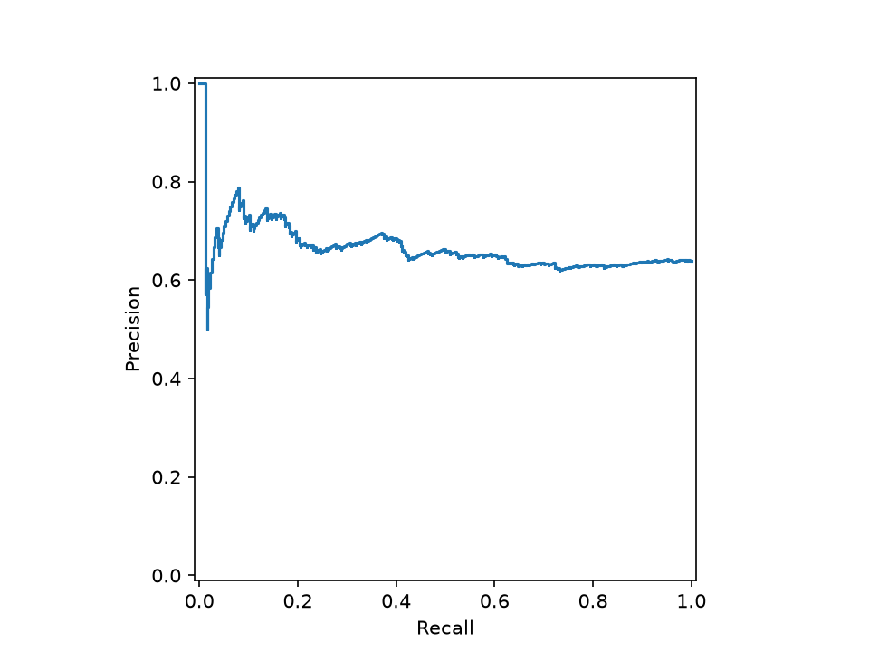
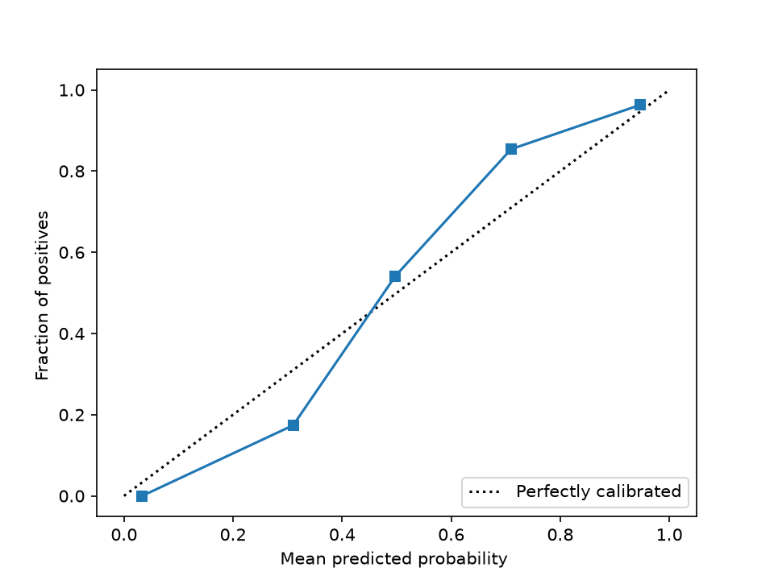

# Model Performance Report: AI Text Detection
**Course:** Software Development Oriented to Machine Learning

## Introduction
This report shows the results of our PyTorch Lightning model. We trained it to see if a text was written by a human or generated by an AI using data like word count and readability. Below are the graphs that show how the model worked in training and in the final evaluation.

## 1. Training Progress (Loss & Accuracy)

**Description:** This graph shows the training loss and accuracy for 20 epochs. 
**Meaning:** During the training phase, the model seemed to learn very well. The loss goes down and the accuracy goes up to around 95% at the end. However, the next graphs show that this success did not transfer to the final evaluation.

## 2. Confusion Matrix

**Description:** This image shows the correct and incorrect predictions made by the model during the evaluation.
**Meaning:** The model did not do a good job here. Instead of having high numbers on the diagonal, the results look very mixed. It correctly guessed arround 50 Human texts and 200 AI texts, but it made 100 false positives and 100 false negatives. This means the model is struggling a lot and it almost looks like it is guessing randomly.

## 3. ROC and Precision-Recall Curves

**Description:** These curves show how well the model separates the "Human" and "AI" classes.
**Meaning:** The ROC curve is very close to the diagonal line in the middle (like a 50/50 coin flip), and the Area Under the Curve (AUC) is very low. The Precision-Recall graph also drops a lot. This tells us that the model has very bad performance when trying to classify the documents and cannot clearly separate the two categories.

## 4. Model Calibration Analysis

**Description:** This graph shows if the model's confidence matches reality.
**Meaning:** The dotted line is the "perfect" calibration. Our model's line is very far from this dotted line and looks completely off. This means we cannot trust the probabilities the model gives. If it says it is 90% sure a text is AI, it is probably wrong.